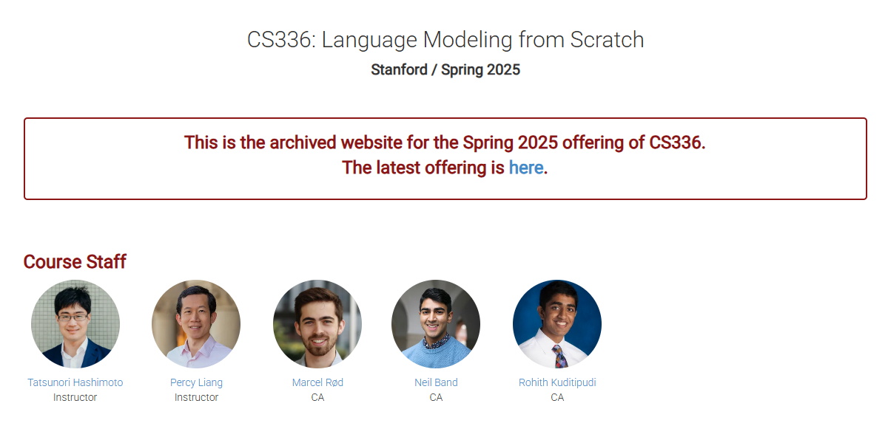
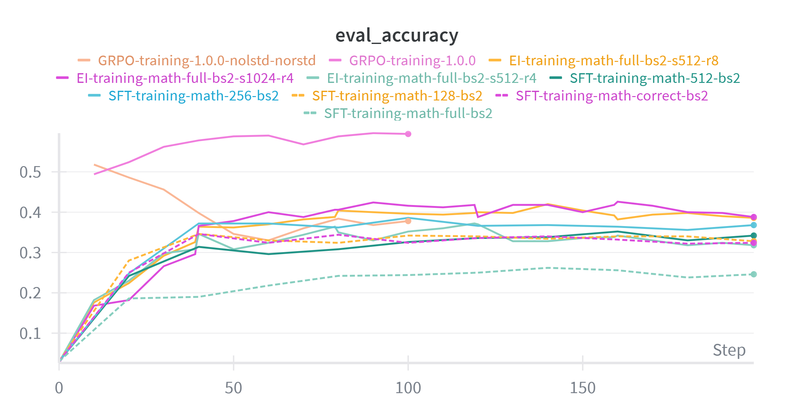
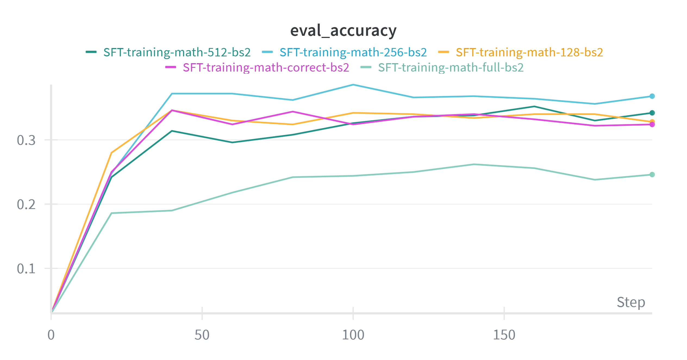
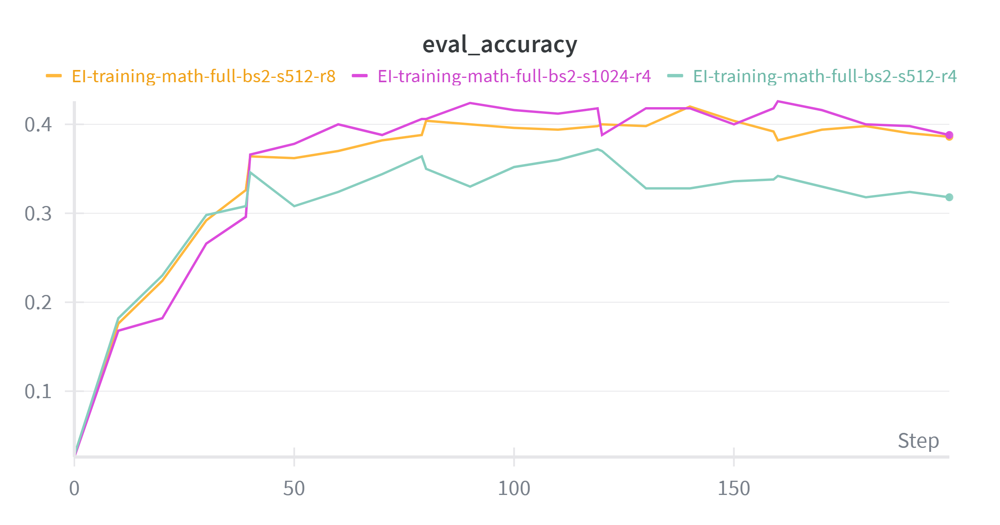
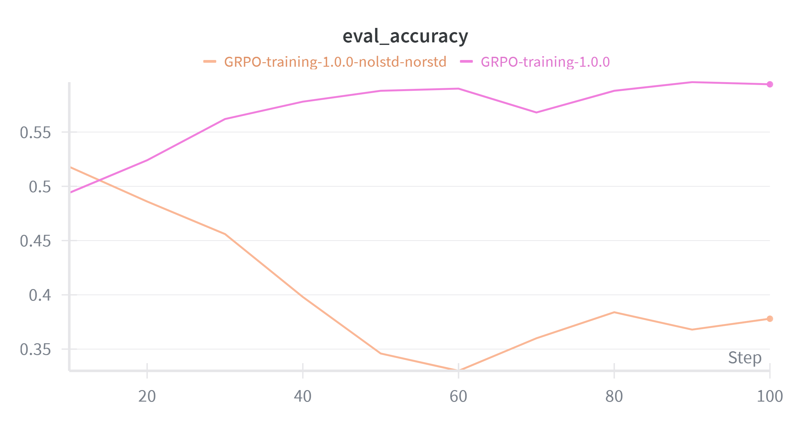

# CS336  Assignment5-Alignment Personal Implementation

<p align="center">
  
  <!-- TODO: 添加项目Banner图片 -->
</p>

---

## 项目任务 📚

本项目是斯坦福大学 **CS336 Spring 2025 Assignment 5: Alignment**，专注于 LLM（大型语言模型）对齐技术的研究与实现。主要实现了以下几种对齐方法：

| 方法 | 全称 | 简介 |
|------|------|------|
| **SFT** | Supervised Fine-Tuning | 监督微调，在精选数据集上训练语言模型 |
| **GRPO** | Group Relative Policy Optimization | 来自 DeepSeekMath/DeepSeek-R1 论文的强化学习方法，通过组内归一化奖励进行策略优化 |
| **Expert Iteration (EI)** | Expert Iteration | 专家迭代，使用正确样本进行迭代改进 |

> 💡 **项目亮点**：使用 **Qwen 2.5 Math 1.5B Base** 模型作为基础模型，这是一个专门针对数学任务优化的语言模型。

---

## 项目介绍 🏠

本项目为 **个人学习项目**，旨在深入理解 LLM 对齐技术的核心原理与实现方法。

### 特点

- 📝 **详细注释**：代码中包含大量中文注释，力求清晰解释每个步骤的原理
- 📖 **完整文档**：配套详细的文档说明（见 `/docs` 目录）
- 🎯 **教学导向**：代码结构清晰，适合学习和研究使用

### 文档路径
以下文档包含项目详细的代码说明。

```
docs/
└── cs336_alignment.md    # 代码详细说明
```

---

## 项目结构 📁

```
cs336_alignment/
├── __init__.py              # 包初始化文件
├── sft.py                   # SFT 核心函数（分词、熵计算、对数概率、训练步）
├── grpo.py                  # GRPO 损失函数（组归一化奖励、裁剪损失、策略梯度）
├── trainer.py                # 主训练器类（SFTDataset, SFTTrainer, EIDataset, EITrainer, GRPODataset, GRPOTrainer）
├── config.py                 # 配置数据类（SFTConfig, GRPOConfig, EIConfig）
├── drgrpo_grader.py         # 奖励函数（R1-Zero风格评分、答案提取与验证）
├── vllm_utils.py            # VLLM推理工具（初始化、响应生成、模型评估）
├── preprocess.py             # 数据预处理（JSON加载、模板转换、数据过滤）
├── utils.py                  # 通用工具（随机种子、数据加载、GPU内存清理）
├── train_sft.py              # SFT 训练入口脚本
├── train_grpo.py             # GRPO 训练入口脚本
├── train_ei.py               # Expert Iteration 训练入口脚本
├── eval.py                   # 评估脚本
├── configs/                 # JSON 配置文件
│   ├── sft.json            # SFT 训练配置
│   ├── grpo.json           # GRPO 训练配置
│   ├── grpo_math.json      # GRPO 数学任务配置
│   └── ...
├── prompts/                  # Prompt 模板
│   ├── r1_zero.prompt      # R1-Zero 风格模板
│   ├── alpaca_sft.prompt   # Alpaca SFT 模板
│   └── ...
├── learning/                 # Jupyter 学习笔记
└── scripts/                  # 辅助脚本
```

### 核心代码功能一览

| 文件 | 主要功能 |
|------|----------|
| `sft.py` | 分词、熵计算、对数概率获取、SFT训练步 |
| `grpo.py` | 组归一化奖励、GRPO裁剪损失、策略梯度计算 |
| `trainer.py` | 数据集管理、训练循环、模型评估 |
| `vllm_utils.py` | vLLM初始化、响应生成、 rollout、模型评估 |
| `drgrpo_grader.py` | 格式检查、答案提取、数学表达式评分 |

---

## 项目用法 🚀

### 前置条件

> ⚠️ **重要**：使用本项目前，必须先处理数据集！

首先需要运行数据预处理脚本，将原始的 MATH 和 GSM8K 数据集处理为训练所需格式：

```bash
# 处理 MATH 数据集和GSM8K 数据集
python cs336_alignment/preprocess.py 
```

### 环境配置

```bash
uv sync --no-install-package flash-attn
uv sync
```

### 运行测试

```bash
uv run pytest
```

### 训练命令

#### 1️⃣ SFT 训练

```bash
uv run cs336_alignment/train_sft.py --json_path cs336_alignment/configs/sft_math.json
```

#### 2️⃣ GRPO 训练

```bash
uv run cs336_alignment/train_grpo.py --json_path cs336_alignment/configs/grpo_math.json
```

#### 3️⃣ Expert Iteration

```bash
uv run cs336_alignment/train_ei.py --json_path cs336_alignment/configs/ei_math_1024_4.json
```

### 评估

```bash
uv run cs336_alignment/eval.py 
```

---

## 项目成果 📊

### 评估指标
> 所有模型**仅在MATH数据集上**进行训练，超参数并非最优，理论最优可能还要更高。

#### MATH 数据集

| 算法 | 准确率 | 配置 |
|------|--------|------|
| Baseline | 2.4% | -|
| SFT | 36.8% | 4090 2×48G |
| EI | 46.6% | 4090 2×48G |
| GRPO |58.2% | H800 80G |

#### GSM8K 数据集

| 算法 | 准确率 | 配置 |
|------|--------|------|
| Baseline | 3.0% | -|
| SFT | - | 4090 2×48G  |
| EI | 58.2% | 4090 2×48G |
| GRPO | 73.7% | H800 80G |

### 参考配置

| 硬件 | 适用算法 | 备注 |
|------|----------|------|
| H800 80G | GRPO | 计算log_prob需要更多显存 |
| 4090 2×48G | SFT, EI | - |

### 运行时间参考

| 算法 | 预计时间 | 硬件配置 |
|------|----------|----------|
| SFT | ~1 小时 | 4090 2×48G |
| EI | ~1 小时 | 4090 2×48G |
| GRPO | ~1.5 小时 | H800 80G |

> ⏱️ **注意**：实际运行时间可能因数据集大小、batch size等因素有所变化

---

## 可视化结果
SFT vs EI vs GRPO算法的可视化对比结果
<p align="center">
  
  <!-- TODO: 添加项目Banner图片 -->
</p>

### SFT训练图像

<p align="center">
  
  <!-- TODO: 添加项目Banner图片 -->
</p>

### EI训练图像

<p align="center">
  
  <!-- TODO: 添加项目Banner图片 -->
</p>

### GRPO训练图像

<p align="center">
  
  <!-- TODO: 添加项目Banner图片 -->
</p>

---

## 数据集说明 📦

### 评估数据集

- `data/math/` - MATH 数学推理数据集
- `data/gsm8k/` - GSM8K 小学数学数据集
- `data/mmlu/` - MMLU 多任务语言理解
- `data/alpaca_eval/` - Alpaca 评估集
- `data/simple_safety_tests/` - 安全测试集

### 预处理后数据

- `preprocessed/math/train.jsonl` - MATH 训练集
- `preprocessed/math/test.jsonl` - MATH 测试集
- `preprocessed/gsm8k/train.jsonl` - GSM8K 训练集
- `preprocessed/gsm8k/test.jsonl` - GSM8K 测试集


## 参考资料 📖

- [DeepSeekMath Paper](https://arxiv.org/abs/2402.03300)
- [GRPO Paper](https://arxiv.org/abs/2401.04150)
- [Stanford CS336 Course](https://cs336.stanford.edu/)
- [Qwen2.5-Math Documentation](https://huggingface.co/Qwen/Qwen2.5-Math-1.5B)

<p align="center">
  <a href="#项目任务-">回到顶部 ↑</a>
</p>
